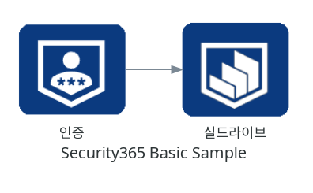
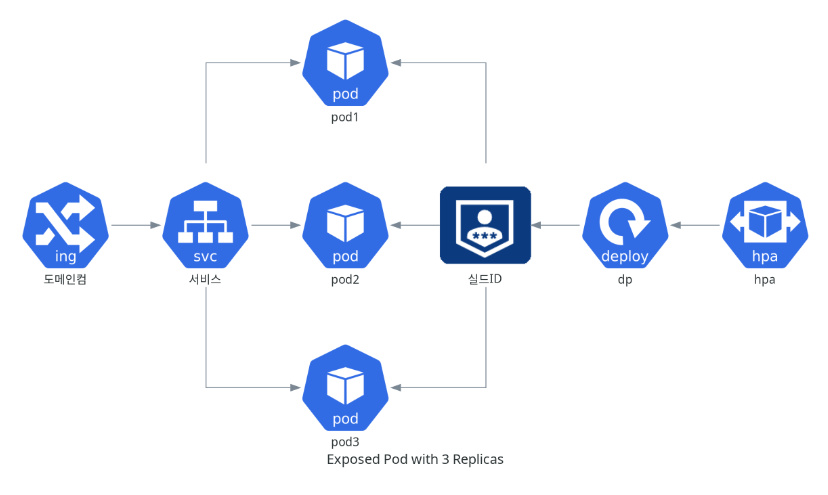

# diagramskor

diagramskor는 diagrams 라이브러리를 확장한 라이브러리입니다. 
이 라이브러리는 diagrams의 Custom 클래스를 이용해서 한국 사이트들의 클라우드의 아이콘을 추가했습니다.  

| 서비스 | 완료 여부 |
|---| ---|
|Security365|  O |
|Naver |  X |
|Kakao | X |

## 설치 방법

diagramskor를 설치하려면 다음 명령어를 사용하세요:

```bash
pip install git+https://github.com/jyjung/diagramskor@master
```

설치가 완료되면, diagramskor를 사용하여 다이어그램을 생성할 수 있습니다.

## 예제

### 간단한 예제
```python
from diagrams import Diagram
from diagramskor import get_node

with Diagram("Security365 Basic Sample"):
    get_node("shieldid","인증") >> get_node("shieldrive","실드라이브")
```



### diagrams의 모듈과 혼합

```python
from diagrams import Diagram
from diagrams.custom import Custom
from diagrams.k8s.clusterconfig import HPA
from diagrams.k8s.compute import Deployment, Pod, ReplicaSet
from diagrams.k8s.network import Ingress, Service
from diagramskor import get_node

with Diagram("Exposed Pod with 3 Replicas"):

    net = Ingress("도메인컴") >> Service("서비스")
    net >> [Pod("pod1"),
            Pod("pod2"),
            Pod("pod3")] << get_node("shieldid","실드ID") << Deployment("dp") << HPA("hpa")
```



## 아이콘 추가 방법 

한두개의 아이콘을 추가할때는 diagrams에서 제공하는 Custom 기능을 사용하세요. 
세트로 아이콘을 추가해야 할때는 다음 코드를 참조 하셔서 추가하시면 됩니다.  

```python
import os
from diagrams.custom import Custom

def get_current_path():
    return os.path.dirname(__file__)

service_list = [ 
    ("containerlinker", os.path.join(get_current_path(),"containerlinker.png")),
    ("infolineage", os.path.join(get_current_path(),"infolineage.png")),
    ("security365",os.path.join(get_current_path(),"security365.png")),
    ("shieldgate",os.path.join(get_current_path(),"shieldgate.png")),
    ("shieldinfo", os.path.join(get_current_path(), "shieldinfo.png")),
    ("shieldrive", os.path.join(get_current_path(), "shieldrive.png")),
    ("shieldrm", os.path.join(get_current_path(), "shieldrm.png")),
    ("cypherdocsflow", os.path.join(get_current_path(), "cypherdocsflow.png")),
    ("remotebrowser", os.path.join(get_current_path(), "remotebrowser.png")),
    ("shieldexmail", os.path.join(get_current_path(), "shieldexmail.png")),
    ("shieldid", os.path.join(get_current_path(), "shieldid.png")),
    ("shieldmail", os.path.join(get_current_path(), "shieldmail.png")),
    ("shieldriveworks", os.path.join(get_current_path(), "shieldriveworks.png")),
    ("shieldshare", os.path.join(get_current_path(), "shieldshare.png"))
]

def get_node(nodename: str, name: str):
    for service in service_list:
        if service[0] == nodename:
            return Custom(name, service[1])
    return Custom("Not Found", "notfound.png")
```

